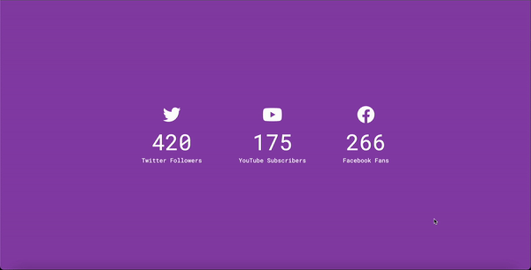

# Incrementing_Counter
A simple web project that showcases an incrementing counter animation.

## Preview

## Technologies Used

- HTML
- CSS
- JavaScript

## Features

- The counter starts from 0 and increments up to a specified number.
- Smooth animation with a counting effect.
- Customizable options for the starting number and animation duration.

## Getting Started

To get a local copy of the project, you can follow these steps:
1. Clone the repository: git clone https://github.com/Lincoln2303/FAQ_Collapse.git
2. Open the index.html file in a web browser.

Usage
1. Specify the starting number and animation duration in the JavaScript code.
2. Open the index.html file in your web browser.
3. Watch the counter increment smoothly to the specified number.

## License

This project is licensed under the [MIT License](LICENSE).

## Acknowledgements

The project is part of the "50 projects in 50 days - HTML, CSS & Javascript" course on Udemy by Brad Traversy.

